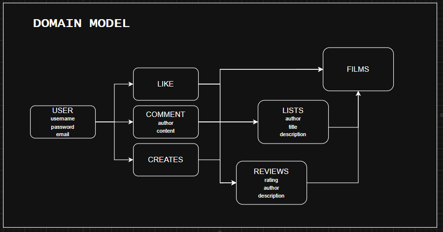
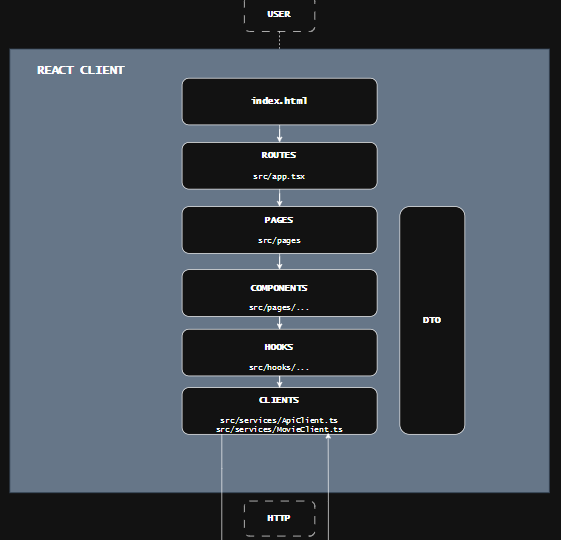
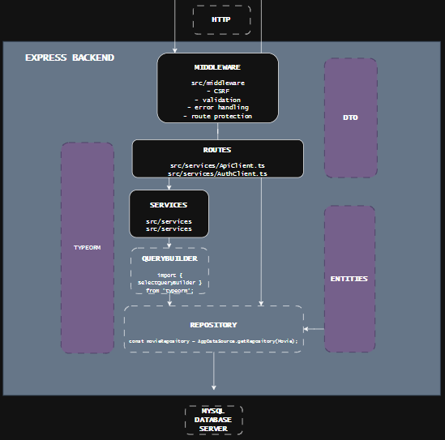
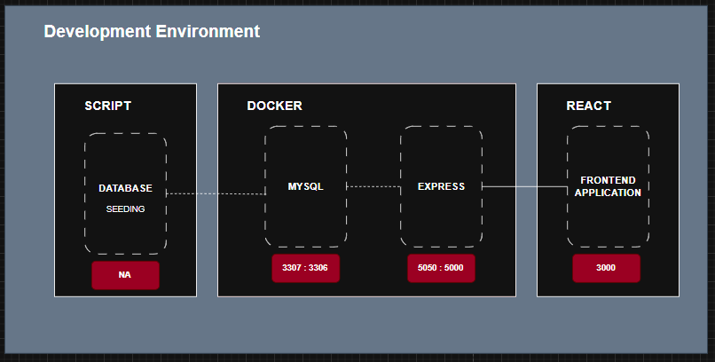
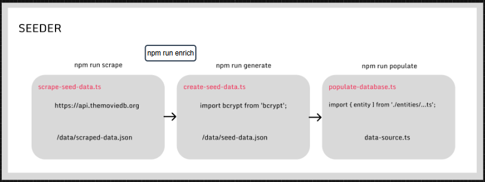

# Letterboxd Clone - Fullstack Project
A fullstack movie review and social media platform.
Inspired by Letterboxd, built with a modern stack.



## Core Functionalities
- user auth & profiles
- movie browsing and search
- review creation and editing
- star rating
- social features (liking, following, reviewing)
- responsive design

## Technical Features
- RESTful API structure
- Session based authentication
- pagination and filtering
- fast and optimized database queries

# The Tech Stack

## Frontend
- React.ts
- zustand useStores
- CSS modules
- React Router
- Axios http client





## Backend
- node.js express server
- mysql database / mysqlite test database
- session based auth with bcrypt encryption
- validation middleware
- documentation @ `http://localhost:5050/api-docs`




## Infrastructure
- hosting: render.com
- database: aiven.io
- CI/CD: auto deploys on push to 'main'
- monitoring: Render dashboard

## Project Structure

```
/
├── frontend/                    # React application
│   ├── src/
│   │   ├── __tests__/          # Test files
│   │   ├── clients/            # API clients and HTTP utilities
│   │   ├── data/               # Mock data, constants, configurations
│   │   ├── DTO/                # Data Transfer Objects/types
│   │   ├── hooks/              # Custom React hooks
│   │   ├── pages/              # Page components
│   │   ├── stores/             # State management (Redux/Zustand)
│   │   └── utils/              # Utility functions
│   ├── public/                 # Static assets
│   ├── package.json
│   └── README.md
│
├── backend/                    # Node Express
│   ├── src/
│   │   ├── __tests__/          # Test files
│   │   ├── entities/           # Database models/entities
│   │   ├── interfaces/         # TypeScript interfaces
│   │   ├── middleware/         # Input / User Validation fex.
│   │   ├── routes/             # API route definitions (simple)
│   │   ├── services/           # DB service layer (complex)
│   │   ├── startup/            # startup/config
│   │   ├── app.ts              # Express app 
│   │   └── index.ts            # entry point
│   ├── package.json
│   └── README.md
│
├── package.json                # Root package.json 
└── README.md                   # This file
```

# Development Environment




```
cd backend
cp .env.example .env  # Configure environment variables
cd ..
docker compose up
```

## Seeder Setup (seperate terminal)
```
cd seeder
cp .env.example .env # must use your own TMDB api key
npm run scrape # can be skipped (data available)
npm run enrich # can be skipped
npm run generate 
npm run populate
```


## Frontend Setup (separate terminal)
```
cd frontend
npm install
cp .env.example .env  # Configure environment variables
npm run dev
```

# Deployment Environment

### 📄 License
This project is for educational purposes. Letterboxd is a trademark of Letterboxd Ltd.

### Deployment URLs:

Frontend: https://frontend-h88t.onrender.com

Backend: https://backend-e62k.onrender.com

##

Last Updated: 2025-12-15
Status: ✅ Operational

Note: Free tier hosting may experience occasional delays during cold starts.

# Exam Final Mentions:

Interesting things to take a look at:

### backend:
- middleware
- entity variables that don't persist
- express request and session definition

### frontend:
- protected routing
- axios interceptors